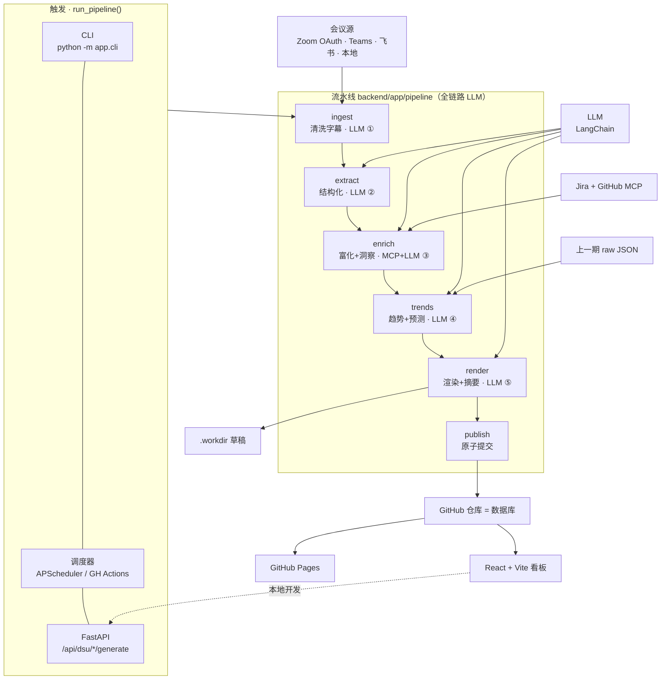
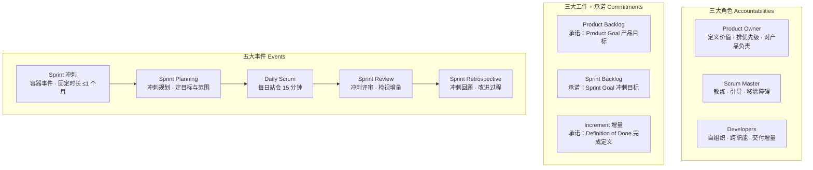

# Scrum Master Agent

把每天的 DSU(Daily Standup)会议变成一份可归档、可追溯到 Jira/GitHub 的静态报告。**全链路 AI**：从 Zoom 字幕清洗到最终报告，每个阶段都经过 LLM。

- **后端**：Python + FastAPI，编排「清洗 → 结构化 → 富化 → 趋势 → 渲染 → 原子提交」流水线
- **LLM 全链路**：LangChain + LangChain-OpenAI，`with_structured_output` 强约束输出；五个 LLM 触点（清洗字幕 / 结构化 / 洞察 / 趋势解读 / 摘要与教练建议），每步失败可独立降级，不阻断出报告
- **会议源**：Zoom Server-to-Server OAuth(云录制 transcript VTT 自动拉取并缓存) / Teams / 飞书 / 本地文件
- **集成**：Jira MCP(内部 Jira Server / DC 用 PAT + SSL 跳过) / GitHub MCP
- **存储**：GitHub 仓库即数据库，每个 pod 一个目录
- **产物**：每天一份自包含静态 HTML，由 GitHub Pages 直接托管
- **前端**：React + Vite 看板，读 `data/dsu-index.json`

### 架构图



---

## 1. 快速开始

```bash
cd backend
python -m venv .venv && source .venv/bin/activate
pip install -e .

cp ../.env.example ../.env  # 填入 LLM / GitHub / Jira / Zoom 凭据
python -m app.cli generate --pod payments-pod --no-mcp   # 不接 MCP；LLM 未配则走规则降级
python -m app.cli generate --pod payments-pod --publish  # 接好后真实发布

uvicorn app.main:app --reload --port 8000   # 看板后端
cd ../frontend && npm install && npm run dev
```

## 2. LLM 全链路（字幕 → 报告）

五个 LLM 触点，每个都可独立降级（没配 key / 网关挂了 → 该步产出留空，绝不阻断出报告）：

| 阶段 | LLM 触点 | 产出 |
|---|---|---|
| ingest | 清洗字幕 | 去时间轴 / 语气词、合并被打断的发言、保留说话人 |
| extract | 结构化 | updates / 阻塞 / 风险 + 情绪 / 会议质量 / 冲刺健康 |
| enrich | 洞察 | 综合站会 + Jira/PR 状态，提炼可行动洞察 `insights` |
| trends | 趋势解读 | 跨期反复主题 `recurring_themes` + 冲刺结果预测 `forecast` |
| render | 摘要 / 教练建议 | 执行摘要 `executive_summary` + 给 SM 的 `coaching_notes` |

降级链：`with_structured_output` → `JsonOutputParser` → 规则切分 / 空字段。统一封装在 `backend/app/llm.py`。

---

## 3. Scrum Master 知识手册

本 Agent 的报告维度与健康雷达，全部围绕以下 Scrum 核心知识点设计。掌握这些，才能读懂报告、用对 Agent。

### 3.1 Scrum 框架总览（Scrum Guide 2020）

Scrum 是一个轻量级框架，帮助团队在复杂环境下通过**经验主义**（透明、检视、适应）持续交付价值。



- **三大角色**：Scrum Master（过程教练）、Product Owner（价值与优先级）、Developers（交付）。三者是**问责制（Accountability）**而非岗位头衔，可以兼任。
- **三大工件 + 三承诺**：每个工件都有一个「承诺」，让工件聚焦并带来透明度：
  - Product Backlog → **Product Goal**（产品要达成什么）
  - Sprint Backlog → **Sprint Goal**（本冲刺要达成什么）
  - Increment → **Definition of Done**（「完成」的统一定义）
- **五大事件**：Sprint 是容器（固定时长、其余事件都发生在其中），Sprint Planning 定方向，Daily Scrum 检视调整，Sprint Review 看增量，Sprint Retrospective 改进过程。
- **经验主义三支柱**：透明（Transparency）、检视（Inspection）、适应（Adaptation）。
- **五大价值观**：承诺（Commitment）、专注（Focus）、开放（Openness）、尊重（Respect）、勇气（Courage）。

### 3.2 Daily Scrum 每日站会

- **时长**：15 分钟，每天同一时间、同一地点（远程同理）。
- **参与者**：Developers 为主；SM 与 PO 可选参加，但不由其主持。
- **目的**：检视 Sprint Goal 进展、调整 Sprint Backlog、规划未来 24 小时的工作。
- **经典三问**（旧版指南，现已弱化但仍常用，也是本 Agent 结构化抽取的基础）：
  1. 昨天我做了什么，帮助团队达成 Sprint Goal？
  2. 今天我计划做什么？
  3. 有哪些障碍阻碍了我？
- **2020 版指南的变化**：不再强制「三问」，改为强调「围绕 Sprint Goal 的进展」，避免站会退化成机械的轮流汇报。
- **常见反模式**（本 Agent 的 `meeting` 维度专门识别）：
  - 变成向 PO / 老板的汇报会（而非团队内部同步）
  - SM 逐个点名、逐人追问（应自组织）
  - 只报状态、不谈目标进展与风险
  - 问题当场展开长讨论（应「会后开小会」，站会只暴露问题）
  - 超过 15 分钟 / 迟到成风

### 3.3 Scrum Master 的职责（Accountabilities）

Scrum Master 是「过程的主人」，通过服务团队、PO、组织三层来落地 Scrum：

| 服务对象 | 核心职责 |
|---|---|
| **Developers** | 教练自组织与跨职能；帮助创造高价值增量；移除阻碍；确保 Scrum 事件有效 |
| **Product Owner** | 帮助定义 Product Goal 与管理 Backlog；建立经验主义的规划；促进干系人协作 |
| **组织** | 领导 / 培训 / 教练 Scrum 采纳；规划 Scrum 实施；帮助理解经验主义方法 |

关键心智：**SM 不做团队该做的事，而是让团队能自己做好。** 提问优于给答案，赋能优于代办。

### 3.4 关键度量与指标

| 指标 | 定义 | 用途 | Agent 字段 |
|---|---|---|---|
| **Burndown 燃尽** | 剩余工作量 vs 时间 | 判断是否 on track | `sprint_m.burndown` |
| **Velocity 速率** | 每冲刺完成的 story points | 规划容量（不用于考核） | `sprint_m.velocity_points` |
| **Cycle Time 周期时间** | 一项工作从开始到完成耗时 | 流动效率 | `flow.cycle_time_days` |
| **Lead Time 交付周期** | 从需求提出到上线 | 端到端效率 | `flow` |
| **WIP 在制品** | 同时进行的工作项数 | 限流、减少上下文切换 | `flow.wip_limit` |
| **阻塞时长 Aging** | 阻塞存在多久 | >3 天升级 | `blockers_m.aging_days` |
| **健康雷达** | 阻塞 / 交付 / 质量 / 流动 / 团队 / 情绪 | 一眼看全局 | `health_breakdown` |

> ⚠️ Velocity 只用于规划，不应作为绩效考核指标——否则团队会「刷点数」而非创造价值（古德哈特定律）。

### 3.5 常见反模式与对策

| 反模式 | 表现 | 对策 | Agent 识别 |
|---|---|---|---|
| 站会变汇报会 | 逐人向 PO 汇报 | 围绕 Sprint Goal 谈进展 | `meeting` |
| 阻塞不升级 | 障碍长期挂着 | 设 aging 阈值自动升级 | `blockers_m.aging_days` |
| 范围蔓延 | 冲刺中不停加需求 | 保护 Sprint Goal，新需求进下期 | `sprint_m.scope_creep` |
| 成员边缘化 | 有人长期不发言 | SM 主动引导参与 | `team.silent` |
| 负载失衡 | 少数人扛多数活 | 均衡分配、关注过载 | `team.overloaded` |
| 冲刺尾期赶工 | 质量下降 | 稳定节奏、控制 WIP | `quality` / `flow` |
| SM 成秘书 | 只记会议纪要 | 教练而非记录员 | 本 Agent 代劳记录，SM 专注教练 |
| 未完成项无脑滚期 | 直接搬下期不反思 | 回顾根因 | `recurring_themes` |

### 3.6 术语表

| 术语 | 说明 |
|---|---|
| Sprint / 冲刺 | 固定时长（≤1 个月）的开发周期 |
| Backlog / 待办清单 | 有序的工作项列表 |
| Increment / 增量 | 符合 DoD、可交付的价值增量 |
| DoD / Definition of Done | 「完成」的统一定义 |
| DoR / Definition of Ready | 「可开始」的定义（非 Scrum 官方工件） |
| Epic / Story / Task | 需求分层（史诗 → 用户故事 → 任务） |
| Spike / 探针 | 用于研究 / 降低不确定性的时间盒 |
| Technical Debt / 技术债 | 为赶工留下的代码欠账 |
| WIP / 在制品 | 进行中的工作项数量 |
| Cycle Time / Lead Time | 周期时间 / 交付周期 |
| Velocity / 速率 | 每冲刺完成的点数 |
| Burndown / 燃尽图 | 剩余工作 vs 时间 |

---

## 4. 关键配置

### `config/pods.yaml`
```yaml
- id: payments-pod
  meeting:
    source: zoom                  # local_file | zoom | teams | feishu
    zoom_topic: 支付组站会         # 在当天录制里挑这场
    time: "09:30"
  wip_limit: 3                   # 用于流动效率告警
```

### `config/mcp.json` 内部 Jira(DC) 配置
```json
{
  "mcpServers": {
    "github": { "command": "npx", "args": ["-y", "@modelcontextplatform/server-github"],
                "env": { "GITHUB_PERSONAL_ACCESS_TOKEN": "${GITHUB_TOKEN}" } },
    "jira":   { "command": "uvx", "args": ["mcp-atlassian"],
                "env": { "JIRA_URL": "${JIRA_URL}",
                         "JIRA_USERNAME": "${JIRA_USERNAME}",
                         "JIRA_API_TOKEN": "${JIRA_PERSONAL_TOKEN}",
                         "JIRA_SSL_VERIFY": "false" } }
  }
}
```
Cloud 只需要把 `JIRA_API_TOKEN` 换成 Cloud 的 API token、删掉 `JIRA_SSL_VERIFY`，代码层无改动。

## 5. 报告维度

对齐市面 Scrum Master Agent 产品（Spinach AI / Geekbot / Range / ClickUp AI / Homeric 等）的做法——报告不只记录「昨天 / 今天 / 阻塞」，还补齐了 SM 真正关心的健康度、情绪、预测与教练视角。完整定义见 `backend/app/models.py`，渲染见 `templates/dsu.html.j2`：

| 维度 | 字段 | 数据源 / 说明 |
|---|---|---|
| 执行摘要 | `executive_summary` | LLM 生成，面向干系人的一段话 |
| 敏捷健康雷达 | `health_breakdown` + `health_score` | 阻塞 / 交付 / 质量 / 流动 / 团队 / 情绪 六维度 0-100，加权成总分 |
| 可行动洞察 | `insights` | LLM 综合站会 + Jira/PR，输出 blocker/risk/win/trend/action |
| 冲刺健康 | `sprint_m` | 目标、承诺点 / 完成点、近期速度、燃尽(on_track/behind/ahead)、范围蔓延 |
| 冲刺预测 | `forecast` | LLM 预测能否按期完成 + 置信度 + 预计完成比例 + 理由 |
| 团队情绪 | `sentiment` | LLM 从措辞语气识别 positive/neutral/stressed/negative，附过载/burnout 预警 |
| 会议质量 | `meeting` | 聚焦度(0-100)、是否围绕三大问题、跑题内容 |
| 反复出现的主题 | `recurring_themes` | LLM 跨期识别（如「部署失败连续三冲刺」） |
| 教练建议 | `coaching_notes` | LLM 给团队 / SM 的改进建议 |
| 交付进展 | `delivery` | 昨日完成 / 今日计划 / WIP / 冲刺承诺-完成-剩余 / 范围变更 |
| 阻塞与依赖 | `blockers_m` | 当日数量、新增、解决；`aging_days` 跨日追踪，>3 天升级；跨团队 / 外部依赖分列 |
| 质量与风险 | `quality` + `risks` | 缺陷开关、CI 失败、部署次数、线上事故、风险等级 |
| 流动效率 | `flow` | 周期时间 / Lead Time、停滞工单、WIP 是否超限 |
| 团队信号 | `team` | 参与人数、未发言、每人负载、过载成员 |
| 行动闭环 | `action_items` + `trend` | owner + due + 逾期 / 携带天数，重复出现的自动从上一期继承 |
| 趋势对比 | `trend` | 阻塞变化 / WIP 变化 / 逾期变化 / 解决数 |

## 6. 数据契约

```json
{
  "pod": "payments-pod",
  "date": "2026-09-06",
  "executive_summary": "今天支付组完成沙箱联调 4 项，新增外部依赖阻塞 1 项，需网关侧配合。",
  "health_score": 96,
  "health_breakdown": { "blockers": 85, "delivery": 100, "quality": 100,
                        "flow": 100, "team": 100, "sentiment": 100 },
  "sentiment": { "overall": "neutral", "signals": [], "burnout_risk": [], "note": "" },
  "sprint_m": { "goal": "沙箱联调闭环", "committed_points": 22, "completed_points": 14,
                "velocity_points": 18, "burndown": "on_track", "scope_creep": [] },
  "forecast": { "on_track": true, "confidence": 0.8, "projected_completion_pct": 85,
                "reasoning": "燃尽正常，阻塞已明确 owner。" },
  "meeting": { "focus_score": 90, "on_agenda": true, "tangents": [], "note": "" },
  "recurring_themes": ["网关沙箱不稳定"],
  "coaching_notes": ["阻塞超过 2 天应升级到 EM 拉通"],
  "insights": [{ "kind": "blocker", "text": "网关沙箱影响 3 人联调",
                 "severity": "high", "owner": "alice" }],
  "delivery": { "done_yesterday": 4, "planned_today": 5, "wip": 5,
                "sprint_commitment": 22, "sprint_completed": 14, "sprint_remaining": 8 },
  "blockers_m": { "total": 1, "new": 1, "resolved": 0,
                  "aging_days": { "alice: 第三方沙箱挂了": 2 },
                  "cross_team": ["数据组对账样本"], "external": ["网关沙箱"] },
  "quality": { "bugs_opened": 1, "bugs_closed": 2, "ci_failures": 0,
               "deploys": 1, "incidents": [] },
  "flow": { "cycle_time_days": 3.2, "stale_tickets": ["PAY-130 In Review 3d"],
            "wip_limit": 3, "wip_breached": false },
  "team": { "participants": 3, "silent": [], "load_by_person": {"alice":2,"bob":2,"carol":1},
            "overloaded": [] },
  "trend": { "blockers": 0, "wip": 1, "overdue_actions": 0, "resolved_since_last": 0 },
  "action_items": [{ "owner": "bob", "text": "...", "due": "2026-09-08", "jira_key": "PAY-135" }]
}
```

> 叙事类字段（`executive_summary` / `forecast` / `recurring_themes` / `coaching_notes` / `insights`）
> 由 LLM 产出；LLM 不可用时留空，其余结构化维度仍正常。

## 7. 同时提交(Atomic Commit)

`run_pipeline` 出 HTML 后一次性通过 `push_files` 把以下文件合到一个 commit：

- `pods/<pod>/dsu/<date>.html` 当日报告
- `pods/<pod>/raw/<date>.json` 结构化原件
- `pods/<pod>/index.html` 该 pod 历史
- `data/dsu-index.json` 全局索引
- `index.html` 根总览

同日重跑覆盖同一路径，天然幂等。

打开 `AUTO_COMMIT=true` 后：生成即提交，跳过人工闸门（适合定时任务）。
保持默认关闭：草稿进 `.workdir`，由看板 / Slack 卡片点「通过」后再提交。

## 8. 分阶段落地路线

| 阶段 | 目标 | 依赖 |
|---|---|---|
| P0 | 手动投喂转录 → JSON → 本地 HTML | 仅 LLM |
| P1 | 接 GitHub MCP，发布到 `pods/<pod>/`，开 Pages | GitHub token |
| P2 | 接 Jira MCP，内部 Jira Server / DC | Jira PAT |
| P3 | Zoom transcript 自动拉取与缓存 | Zoom OAuth |
| P4 | React 看板 + 对话式追问 + 行动项回写 Jira | 后端 API |
| P5 | 多期聚合：健康雷达趋势 / 冲刺预测历史 / 情绪趋势面板 | 富化扩展 |

## 9. 坑与注意事项

- **草稿 → 人工确认 → 发布**：转录质量不稳定，自动发布错报告比不发更糟。
- **LLM 降级**：五个 LLM 触点任一步失败都要留空继续，绝不能因 LLM 挂了发不出报告。
- **内部 Jira SSL**：自签证书时常需要 `JIRA_SSL_VERIFY=false`，或把证书放进容器信任链。
- **Zoom 转写**：必须在 Zoom 后台打开「云录制 → 音频转写」。Transcript 文件类型为 `TRANSCRIPT`。
- **Jira 写操作**：自动建单/流转是高风险动作，代码里默认 `allow_jira_write: false`。
- **时区**：DSU 日期以 pod 所在时区为准，不要用 UTC。
- **脱敏**：转录进 LLM 前剔除密码、token、客户名。

## 10. 目录

```
.
├── config/            pods.yaml, mcp.json
├── backend/           FastAPI + 流水线
│   └── app/
│       ├── config.py  models.py  llm.py  mcp_client.py  main.py  cli.py  scheduler.py
│       ├── pipeline/  ingest → extract → enrich → trends → render → publish
│       └── templates/ dsu.html.j2  index.html.j2
├── frontend/          React + Vite 看板
└── .github/workflows/ daily-dsu.yml
```
