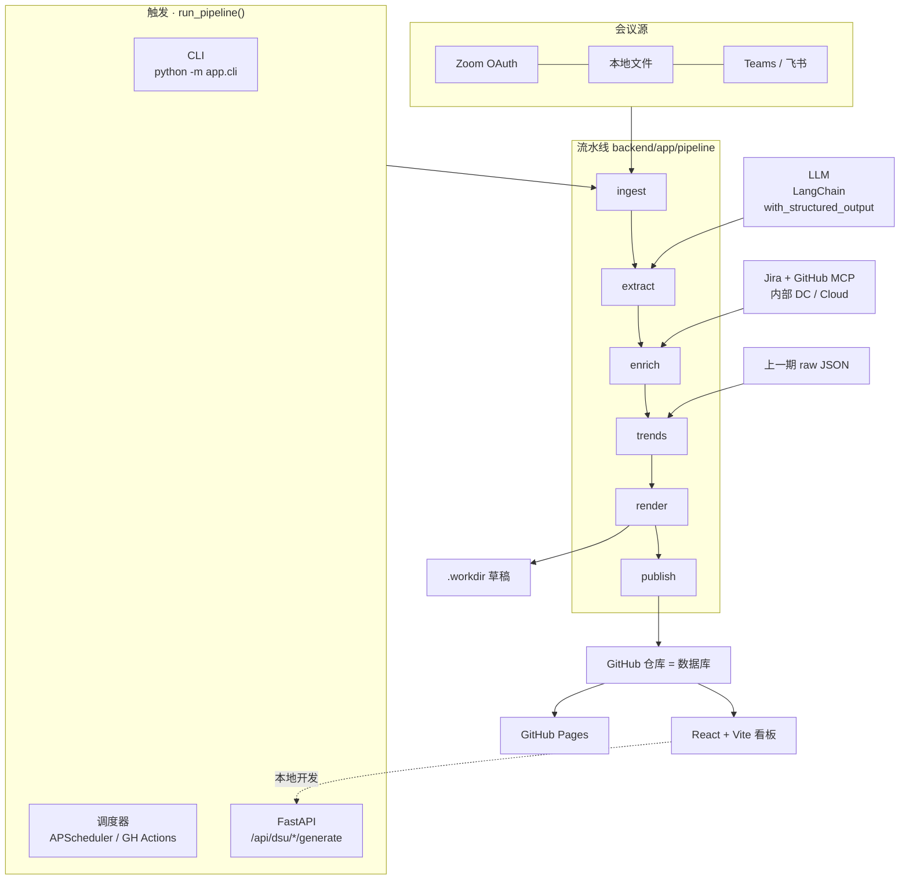

# Scrum Master Agent

把每天的 DSU(Daily Standup)会议变成一份可归档、可追溯到 Jira/GitHub 的静态报告。

- **后端**：Python + FastAPI，编排「抽取 → 富化 → 趋势对比 → 渲染 → 原子提交」流水线
- **LLM**：LangChain + LangChain-OpenAI，`with_structured_output` 强约束输出，函数调用失败时降级到 JsonOutputParser
- **会议源**：Zoom Server-to-Server OAuth(云录制 transcript VTT 自动拉取并缓存) / Teams / 飞书 / 本地文件
- **集成**：Jira MCP(内部 Jira Server / DC 用 PAT + SSL 跳过) / GitHub MCP
- **存储**：GitHub 仓库即数据库，每个 pod 一个目录
- **产物**：每天一份自包含静态 HTML，由 GitHub Pages 直接托管
- **前端**：React + Vite 看板，读 `data/dsu-index.json`

### 架构图



---

## 1. 快速开始

```bash
cd backend
python -m venv .venv && source .venv/bin/activate
pip install -e .

cp ../.env.example ../.env  # 填入 LLM / GitHub / Jira / Zoom 凭据
python -m app.cli generate --pod payments-pod --no-mcp   # 不接 MCP 先跑通链路
python -m app.cli generate --pod payments-pod --publish  # 接好后真实发布

uvicorn app.main:app --reload --port 8000   # 看板后端
cd ../frontend && npm install && npm run dev
```

## 2. 关键配置

### `config/pods.yaml`
```yaml
- id: payments-pod
  meeting:
    source: zoom                  # local_file | zoom | teams | feishu
    zoom_topic: 支付组站会         # 在当天录制里挑这场
    time: "09:30"
  wip_limit: 3                   # 用于流动效率告警
```

### `config/mcp.json` 内部 Jira(DC) 配置
```json
{
  "mcpServers": {
    "github": { "command": "npx", "args": ["-y", "@modelcontextplatform/server-github"],
                "env": { "GITHUB_PERSONAL_ACCESS_TOKEN": "${GITHUB_TOKEN}" } },
    "jira":   { "command": "uvx", "args": ["mcp-atlassian"],
                "env": { "JIRA_URL": "${JIRA_URL}",
                         "JIRA_USERNAME": "${JIRA_USERNAME}",
                         "JIRA_API_TOKEN": "${JIRA_PERSONAL_TOKEN}",
                         "JIRA_SSL_VERIFY": "false" } }
  }
}
```
Cloud 只需要把 `JIRA_API_TOKEN` 换成 Cloud 的 API token、删掉 `JIRA_SSL_VERIFY`，代码层无改动。

## 3. 报告维度

完整见 `backend/app/models.py` 与 `templates/dsu.html.j2`：

| 维度 | 字段 | 数据源 |
|---|---|---|
| 交付进展 | `delivery` | 昨日完成 / 今日计划 / WIP / 冲刺承诺-完成-剩余 / 范围变更 |
| 阻塞与依赖 | `blockers_m` | 当日数量、新增、解决；`aging_days` 跨日追踪，>3 天升级；跨团队 / 外部依赖分列 |
| 质量与风险 | `quality` + `risks` | 缺陷开关、CI 失败、部署次数、线上事故、风险等级 |
| 流动效率 | `flow` | 周期时间 / Lead Time、停滞工单、WIP 是否超限 |
| 团队信号 | `team` | 参与人数、未发言、每人负载、过载成员 |
| 行动闭环 | `action_items` + `trend` | owner + due + 逾期 / 携带天数，重复出现的自动从上一期继承 |
| 趋势对比 | `trend` | 阻塞变化 / WIP 变化 / 逾期变化 / 解决数 |
| 综合 | `health_score` 0-100 | 上面六项加权，超过 3 天阻塞 30 分扣满 |

## 4. 数据契约

```json
{
  "pod": "payments-pod",
  "date": "2026-09-06",
  "delivery": { "done_yesterday": 4, "planned_today": 5, "wip": 5,
                "sprint_commitment": 22, "sprint_completed": 14, "sprint_remaining": 8 },
  "blockers_m": { "total": 1, "new": 1, "resolved": 0,
                  "aging_days": { "alice: 第三方沙箱挂了": 2 },
                  "cross_team": ["数据组对账样本"], "external": ["网关沙箱"] },
  "quality": { "bugs_opened": 1, "bugs_closed": 2, "ci_failures": 0,
               "deploys": 1, "incidents": [] },
  "flow": { "cycle_time_days": 3.2, "stale_tickets": ["PAY-130 In Review 3d"],
            "wip_limit": 3, "wip_breached": false },
  "team": { "participants": 3, "silent": [], "load_by_person": {"alice":2,"bob":2,"carol":1},
            "overloaded": [] },
  "trend": { "blockers": 0, "wip": 1, "overdue_actions": 0, "resolved_since_last": 0 },
  "action_items": [{ "owner": "bob", "text": "...", "due": "2026-09-08", "jira_key": "PAY-135" }],
  "health_score": 88
}
```

## 5. 同时提交(Atomic Commit)

`run_pipeline` 出 HTML 后一次性通过 `push_files` 把以下文件合到一个 commit：

- `pods/<pod>/dsu/<date>.html` 当日报告
- `pods/<pod>/raw/<date>.json` 结构化原件
- `pods/<pod>/index.html` 该 pod 历史
- `data/dsu-index.json` 全局索引
- `index.html` 根总览

同日重跑覆盖同一路径，天然幂等。

打开 `AUTO_COMMIT=true` 后：生成即提交，跳过人工闸门（适合定时任务）。
保持默认关闭：草稿进 `.workdir`，由看板 / Slack 卡片点「通过」后再提交。

## 6. 分阶段落地路线

| 阶段 | 目标 | 依赖 |
|---|---|---|
| P0 | 手动投喂转录 → JSON → 本地 HTML | 仅 LLM |
| P1 | 接 GitHub MCP，发布到 `pods/<pod>/`，开 Pages | GitHub token |
| P2 | 接 Jira MCP，内部 Jira Server / DC | Jira PAT |
| P3 | Zoom transcript 自动拉取与缓存 | Zoom OAuth |
| P4 | React 看板 + 对话式追问 + 行动项回写 Jira | 后端 API |
| P5 | DORA、流动效率、趋势面板 | 富化扩展 |

## 7. 坑与注意事项

- **草稿 → 人工确认 → 发布**：转录质量不稳定，自动发布错报告比不发更糟。
- **内部 Jira SSL**：自签证书时常需要 `JIRA_SSL_VERIFY=false`，或把证书放进容器信任链。
- **Zoom 转写**：必须在 Zoom 后台打开「云录制 → 音频转写」。Transcript 文件类型为 `TRANSCRIPT`。
- **Jira 写操作**：自动建单/流转是高风险动作，代码里默认 `allow_jira_write: false`。
- **时区**：DSU 日期以 pod 所在时区为准，不要用 UTC。
- **脱敏**：转录进 LLM 前剔除密码、token、客户名。

## 8. 目录

```
.
├── config/            pods.yaml, mcp.json
├── backend/           FastAPI + 流水线
│   └── app/
│       ├── config.py  models.py  mcp_client.py  main.py  cli.py  scheduler.py
│       ├── pipeline/  ingest → extract → enrich → trends → render → publish
│       └── templates/ dsu.html.j2  index.html.j2
├── frontend/          React + Vite 看板
└── .github/workflows/ daily-dsu.yml
```